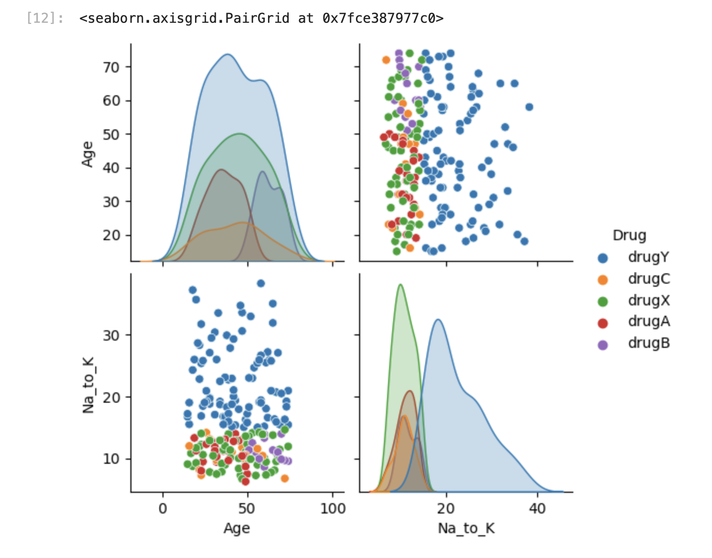
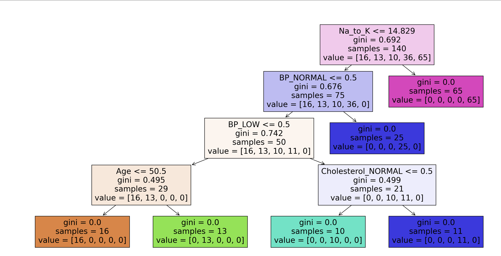
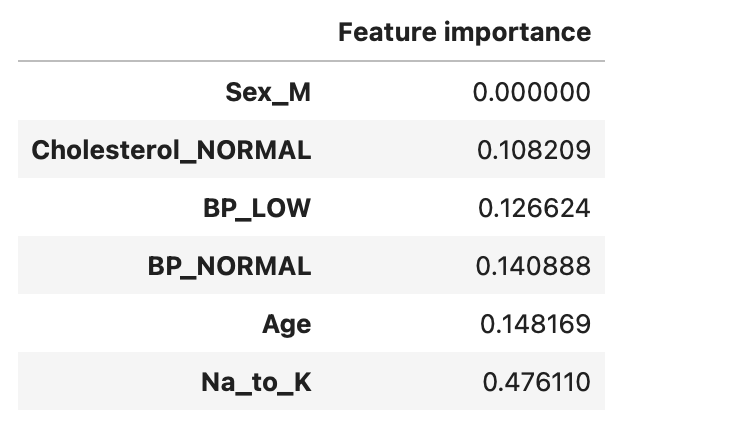
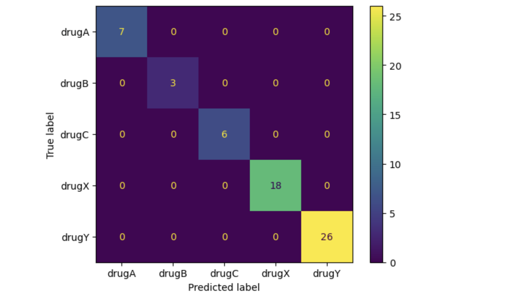

# Drug Classification Using Decision Tree Models

This project develops and compares multiple Decision Tree classifiers to predict the most appropriate drug based on patient characteristics. Different tree configurations, including Gini, Entropy, pruning, and maximum leaf constraints, are evaluated to analyze their impact on predictive performance and model interpretability.

---

## Project objectives

- Explore and understand the dataset through exploratory data analysis (EDA).
- Prepare the data for machine learning by encoding categorical variables.
- Train multiple Decision Tree classification models.
- Compare different tree configurations using evaluation metrics.
- Interpret feature importance and decision rules.
- Predict the most appropriate drug for a new patient.

---

## Dataset

The dataset contains demographic and clinical information from patients, including:

- Age
- Sex
- Blood Pressure (BP)
- Cholesterol
- Sodium-to-Potassium Ratio (Na_to_K)

The target variable is the prescribed drug.

---

## Technologies Used

- Python
- Pandas
- NumPy
- Matplotlib
- Seaborn
- Scikit-learn

---

## Project workflow

1. Data loading and exploration
2. Exploratory Data Analysis (EDA)
3. Data preprocessing
4. Feature encoding
5. Train-test split
6. Decision Tree model development
7. Hyperparameter comparison
8. Model evaluation
9. Feature importance analysis
10. Prediction for a new patient

---

## Model comparison

The following Decision Tree models were evaluated:

| Model | Description |
|-------|-------------|
| Baseline | Default Decision Tree using the Gini criterion |
| Pruned Tree | Maximum depth limited to 2 |
| Maximum Leaf Nodes | Tree complexity limited by leaf nodes |
| Entropy Tree | Decision Tree using the Entropy criterion |

---

## Results

The baseline Decision Tree achieved the best overall performance among the evaluated models.

Key findings include:

- High classification performance across drug categories.
- The **Na_to_K** variable was the most influential predictor.
- Restricting tree complexity reduced interpretability gains without improving predictive performance.
- Comparing multiple Decision Tree configurations demonstrated how hyperparameters affect model behavior.

---

## Repository structure

```
drug-classification-decision-tree/
│
├── Drug_classification.ipynb
├── README.md
└── images/
```

---
## Project visualizations

### Pairplot



### Decision Tree



### Feature Importance



### Confusion Matrix



## Future improvements

- Perform hyperparameter optimization using GridSearchCV.
- Compare Decision Trees with ensemble methods such as Random Forest and XGBoost.
- Evaluate additional classification metrics.
- Deploy the trained model as a simple web application.

---

## Author

** Jose Hiram Méndez Ramirez**

M.Sc. in Animal Health and Production | Data Science Student
